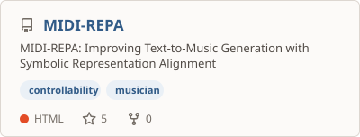
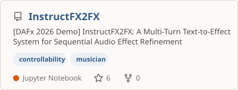
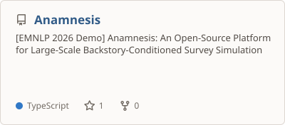
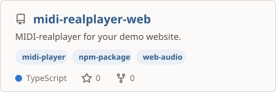
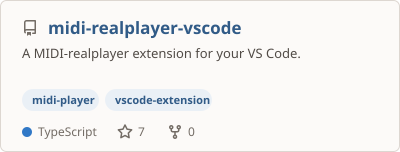
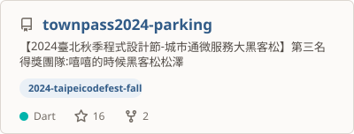
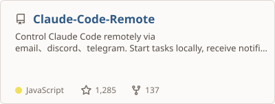

<!-- Generated from profile/index.html. Update artwork with: npm run export -->
<a href="https://vaclis.net/">
  <picture>
    <source media="(max-width: 600px) and (prefers-color-scheme: dark)" srcset="assets/generated/profile-mobile-dark.png" />
    <source media="(max-width: 600px)" srcset="assets/generated/profile-mobile-light.png" />
    <source media="(prefers-color-scheme: dark)" srcset="assets/generated/profile-desktop-dark.png" />
    
  </picture>
</a>

 

<a href="https://vaclis.net/">vaclis.net</a>

# Research

  <a href="https://github.com/vaclisinc/PitchBench">
    <picture>
      <source media="(prefers-color-scheme: dark)" srcset="assets/cards/vaclisinc--PitchBench-dark.svg" />
      
    </picture>
  </a>
  <a href="https://github.com/vaclisinc/MIDI-REPA">
    <picture>
      <source media="(prefers-color-scheme: dark)" srcset="assets/cards/vaclisinc--MIDI-REPA-dark.svg" />
      
    </picture>
  </a>

  <a href="https://github.com/vaclisinc/InstructFX2FX">
    <picture>
      <source media="(prefers-color-scheme: dark)" srcset="assets/cards/vaclisinc--InstructFX2FX-dark.svg" />
      
    </picture>
  </a>
  <a href="https://github.com/DavidMChan/Anamnesis">
    <picture>
      <source media="(prefers-color-scheme: dark)" srcset="assets/cards/DavidMChan--Anamnesis-dark.svg" />
      
    </picture>
  </a>

# My MIR tools

  <a href="https://github.com/vaclisinc/midi-realplayer">
    <picture>
      <source media="(prefers-color-scheme: dark)" srcset="assets/cards/vaclisinc--midi-realplayer-web-dark.svg" />
      
    </picture>
  </a>
  <a href="https://github.com/vaclisinc/midi-realplayer-vscode">
    <picture>
      <source media="(prefers-color-scheme: dark)" srcset="assets/cards/vaclisinc--midi-realplayer-vscode-dark.svg" />
      
    </picture>
  </a>

  <a href="https://github.com/vaclisinc/AMTFlow">
    <picture>
      <source media="(prefers-color-scheme: dark)" srcset="https://github-stats-extended.vercel.app/api/pin/?username=vaclisinc&amp;repo=AMTFlow&amp;description_lines_count=3&amp;card_width=400&amp;disable_animations=true&amp;theme=dark_github_repocard" />
      
    </picture>
  </a>

# Open source

  <a href="https://github.com/asuc-octo/berkeleytime">
    <picture>
      <source media="(prefers-color-scheme: dark)" srcset="assets/cards/asuc-octo--berkeleytime-dark.svg" />
      
    </picture>
  </a>
  <a href="https://github.com/taipei-doit/townpass2024-parking">
    <picture>
      <source media="(prefers-color-scheme: dark)" srcset="assets/cards/taipei-doit--townpass2024-parking-dark.svg" />
      
    </picture>
  </a>

  <a href="https://github.com/JessyTsui/Claude-Code-Remote">
    <picture>
      <source media="(prefers-color-scheme: dark)" srcset="assets/cards/JessyTsui--Claude-Code-Remote-dark.svg" />
      
    </picture>
  </a>

